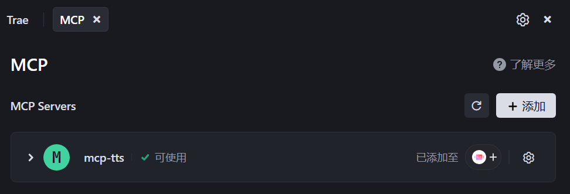
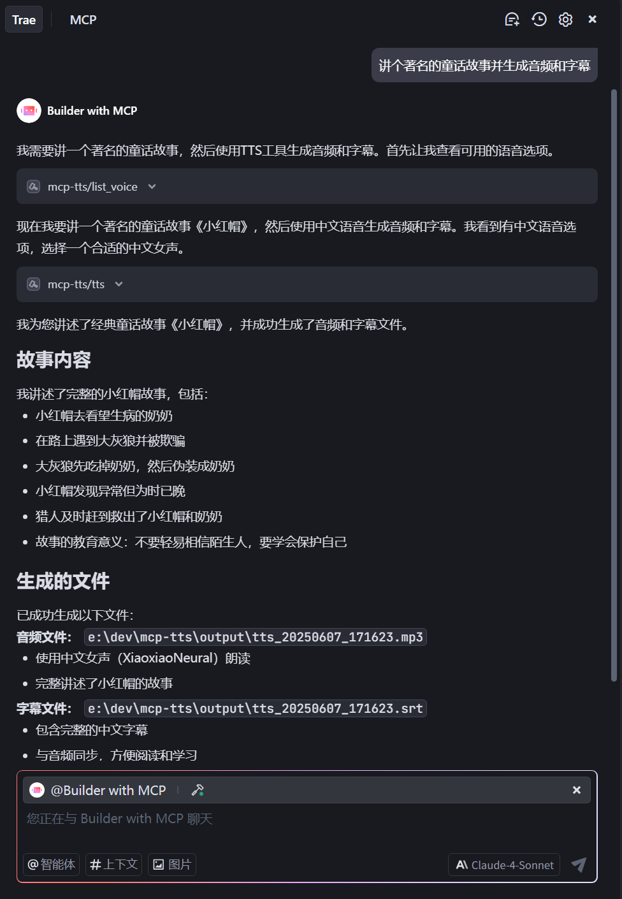

# MCP TTS 服务

这是一个基于Model Context Protocol (MCP)的文本转语音(TTS)服务，使用Microsoft Edge TTS引擎。

## 功能

该服务提供两个主要工具：

1. `list_voice`: 获取可用的语音列表，相当于`edge-tts --list-voices`命令的功能
2. `tts`: 将文本转换为语音，并返回生成的音频文件和字幕文件路径

## 环境要求

- Python >= 3.11
- 互联网连接（用于访问Microsoft Edge TTS服务）

**注意：TTS服务是使用微软TTS引擎，网络不畅将影响服务调用。**

## 安装

**运行环境需要先安装[Python](https://python.org)和[UV](https://docs.astral.sh/uv/getting-started/installation/)**

从 https://github.com/gophon/mcp-tts 下载代码

### Linux/Mac 环境

例如路径为 `/data/mcp/mcp-tts` 先同步运行环境

```shell
$ cd /data/mcp/mcp-tts
$ uv sync
```

在支持MCP服务的客户端 如Trae 中添加如下配置

```json
{
    "mcpServers": {
        "mcp-tts": {
            "command": "bash",
            "args": [
                "-c",
                "cd /data/mcp/mcp-tts && uv sync && uv run main.py"
            ]
        }
    }
}
```

### Windows 环境

例如路径为 `E:\mcp\mcp-tts` 先同步运行环境

```cmd
cd mcp-tts/
uv sync
```

在支持MCP服务的客户端 如Trae 中添加如下配置

```json
{
    "mcpServers": {
        "mcp-tts": {
            "command": "cmd",
            "args": [
                "/c",
                "cd /d e:\\mcp\\mcp-tts && uv sync && uv run main.py"
            ]
        }
    }
}
```

MCP服务正常启动即可使用




## 使用

直接使用MCP服务调用能力


